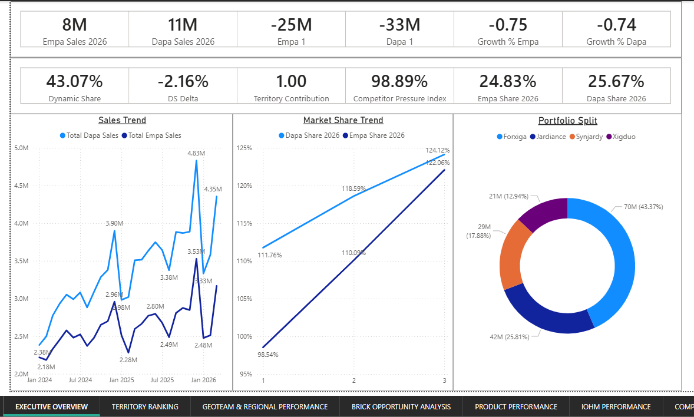
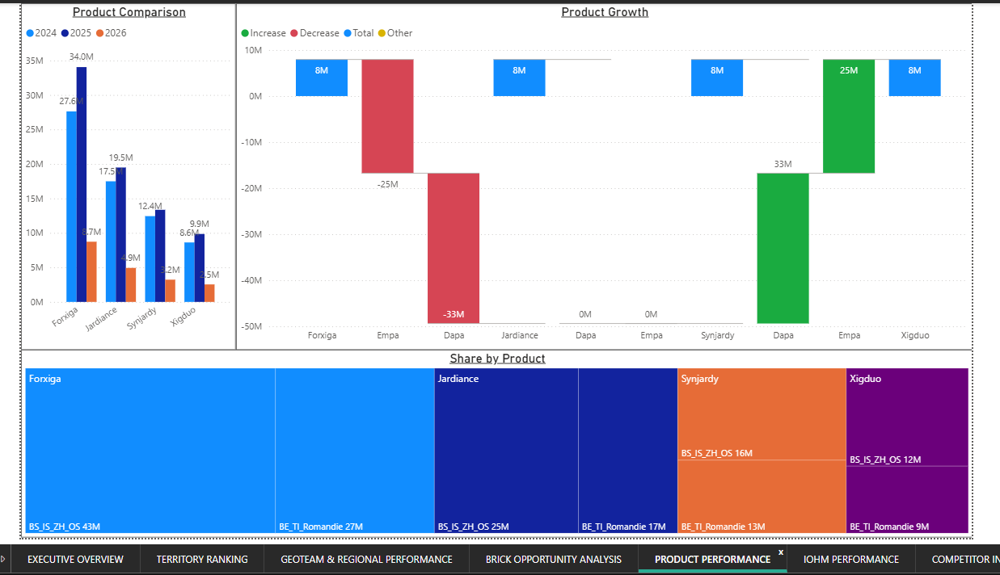
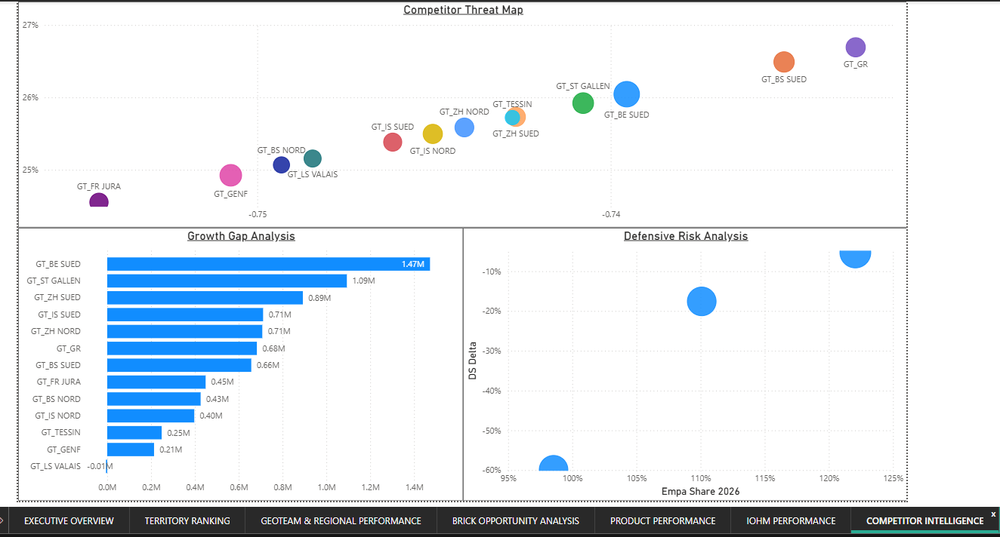

# 📊 Pharmaceutical Competitive Intelligence

## Project Overview

This project delivers a comprehensive Power BI dashboard designed to analyze the competitive performance of diabetes brands within the SGLT2 inhibitor market. The analysis focuses on comparing **Jardiance** and **Synjardy** (Empa portfolio) against **Forxiga** and **Xigduo** (Dapa portfolio) across territories, GeoTeams, regions, and bricks.

Using advanced DAX calculations, dynamic ranking methodologies, and interactive visualizations, the dashboard provides actionable insights that support commercial strategy, sales force effectiveness, territory prioritization, and market share growth.

---

## Business Objective

The goal of this analysis is to determine:

- Whether the company's products are gaining or losing market share.
- Which territories and regions drive growth.
- Where competitors are strongest.
- Which GeoTeams and sales representatives are most effective.
- Which bricks represent the largest future opportunities.
- How commercial resources should be allocated to maximize ROI.

---

## Business Questions Answered

- Are Jardiance and Synjardy outperforming Forxiga and Xigduo?
- Which territories are gaining market share?
- Which territories are losing share to competitors?
- What are the highest-priority territories for future investment?
- Which GeoTeams consistently outperform?
- Which products contribute most to growth?
- Which bricks have the greatest growth potential?

---

## Tools Used

- Power BI Desktop
- Power Query
- DAX (Data Analysis Expressions)
- Microsoft Excel
- Data Modeling
- Business Intelligence & Analytics

---

## Dataset Overview

### Company Products (Empa Portfolio)

- Jardiance
- Synjardy

### Competitor Products (Dapa Portfolio)

- Forxiga
- Xigduo

### Supporting Data

- Territory Mapping
- GeoTeam Assignments
- CRM Data
- IQVIA Mapping
- KAM Data
- Incentive Data
- Product Master Data

---

## Data Preparation

### Data Cleaning

- Standardized product names
- Validated territory mappings
- Corrected data types
- Removed inconsistencies

### Data Transformation

Created custom product group classifications:

| Product | Product Group |
|----------|----------|
| Jardiance | Empa |
| Synjardy | Empa |
| Forxiga | Dapa |
| Xigduo | Dapa |

### Data Modeling

Implemented a Star Schema model consisting of:

#### Fact Table

- Monthly DOT Sales

#### Dimension Tables

- Calendar
- Territory
- Region
- GeoTeam
- CRM
- KAM
- IQVIA Mapping

---

## Key KPIs

### Growth KPIs

- Empa Growth
- Dapa Growth
- Growth Gap
- Growth %
- Territory Contribution

### Market Share KPIs

- Empa Share %
- Dapa Share %
- Dynamic Share
- Dynamic Share Rank

### Market Share Change KPIs

- DS Delta
- DS Delta Rank
- Share Gain %

### Territory Ranking KPIs

- Abs Rank
- Size Rank
- Dynamic Share Rank
- DS Delta Rank
- Sum Rank
- Rank Rank

### Commercial Excellence KPIs

- Opportunity Score
- Competitor Pressure Index
- White Space Score
- Market Dominance Score
- Emerging Territory Score

---

## DAX Highlights

### Growth Gap

```DAX
Growth Gap =
[Empa Growth] - [Dapa Growth]
```

### Dynamic Share

```DAX
Dynamic Share =
[Empa Share 2026] + [Dapa Share 2026]
```

### DS Delta

```DAX
DS Delta =
[Dynamic Share 2026] - [Dynamic Share 2025]
```

### Sum Rank

```DAX
Sum Rank =
[Abs Rank]
+
[Dynamic Share Rank]
+
[DS Delta Rank]
+
[Size Rank]
```

### Rank Rank

```DAX
Rank Rank =
RANKX(
    ALL('Monthly DOT Sales'[Territory 2026]),
    [Sum Rank],
    ,
    ASC,
    DENSE
)
```

---

# Dashboard Pages

### 1️⃣ Executive Overview

### 2️⃣ Territory Ranking Dashboard

### 3️⃣ GeoTeam & Regional Performance

### 4️⃣ Brick Opportunity Analysis

### 5️⃣ Product Performance Dashboard

### 6️⃣ Sales Force Performance

### 7️⃣ Competitive Intelligence Dashboard

---

## Key Insights Generated

### Market Share Analysis

- Identified territories gaining market share.
- Detected regions vulnerable to competitor growth.
- Monitored share shifts across GeoTeams.

### Commercial Excellence

- Ranked territories using a multi-factor scoring model.
- Identified high-potential territories.
- Prioritized resource allocation opportunities.

### Product Performance

- Determined growth contribution by product.
- Compared company and competitor portfolios.
- Measured product-level share gains and losses.

### Sales Force Effectiveness

- Evaluated GeoTeam performance.
- Assessed territory management effectiveness.
- Identified top-performing sales representatives.

---

## Skills Demonstrated

### Power BI

- Data Modeling
- Advanced DAX
- Dashboard Design
- Interactive Reporting

### Data Analytics

- Market Share Analysis
- Competitive Intelligence
- Commercial Analytics
- Business Performance Analysis

### Data Preparation

- Power Query
- Data Cleaning
- Data Transformation
- Data Validation

### Business Intelligence

- KPI Development
- Executive Reporting
- Strategic Analysis
- Decision Support

---

## Business Impact

The dashboard enables commercial leadership to:

- Monitor market share performance.
- Identify growth opportunities.
- Detect competitive threats early.
- Optimize sales force allocation.
- Improve territory targeting.
- Support data-driven decision-making.

---

## Dashboard Preview

> Add screenshots of your Power BI dashboard here.

### Executive Overview



### Territory Ranking Dashboard



### Competitive Intelligence Dashboard



---

## Author

### Ismail Owolabi

Data Analyst | Power BI Developer | Business Intelligence Enthusiast

- LinkedIn: www.linkedin.com/in/ismail-owolabi
- GitHub: github.com/Owo-Ismail

---

⭐ If you found this project useful, feel free to star the repository.
